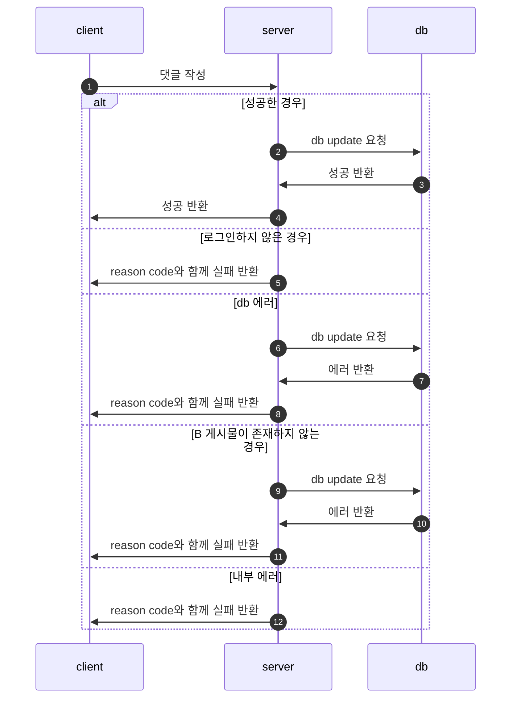
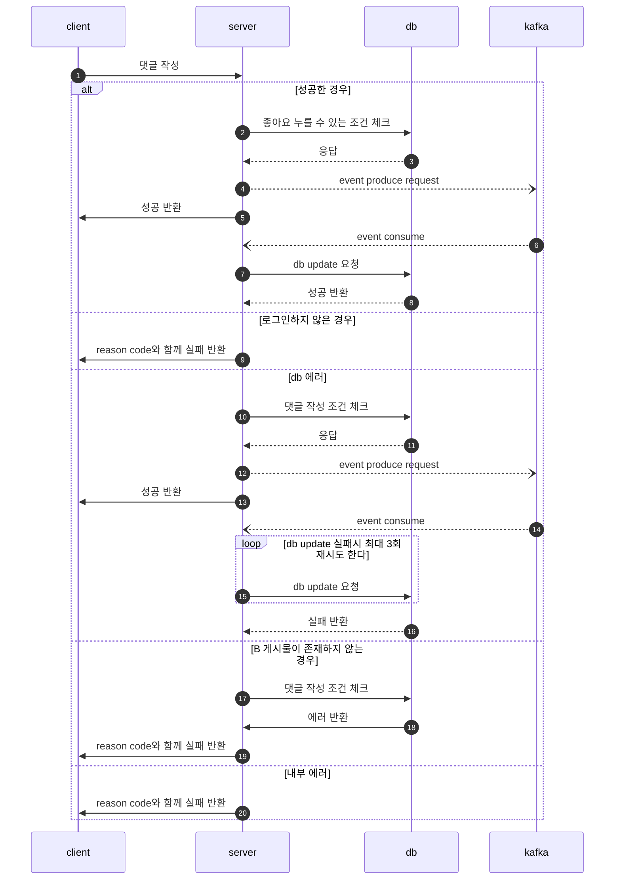
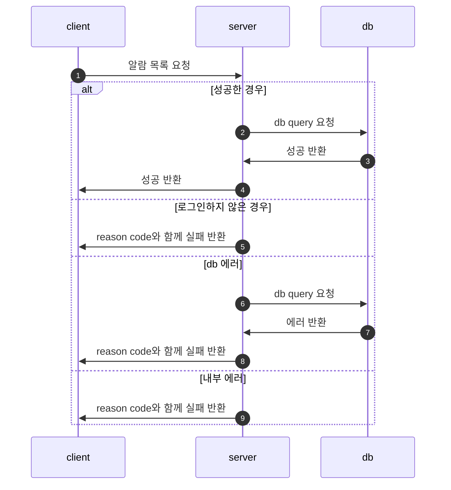

## Flow Chart

1. 회원가입

2. 로그인

3. 포스트 작성

4. 포스트 삭제

5. 포스트 수정

6. 피드 목록

7. 좋아요 기능 : User A가 B 게시물에 좋아요를 누른 상황

8. 댓글 기능 : User A가 B 게시물에 댓글을 남긴 상황

```mermaid
sequenceDiagram
autonumber
client ->> server: 댓글 작성
    alt 성공한 경우
    server ->> db : db update 요청
    db ->> server : 성공 반환
    server->>client: 성공 반환
    else 로그인하지 않은 경우
    server->>client: reason code와 함께 실패 반환
    
    else db 에러
    server ->> db : db update 요청
    db ->> server : 에러 반환
    server->>client: reason code와 함께 실패 반환
    
    else B 게시물이 존재하지 않는 경우 
    server ->> db : db update 요청
    db ->> server : 에러 반환
    server->>client: reason code와 함께 실패 반환
    
    else 내부 에러
    server->>client: reason code와 함께 실패 반환
    end
```

```mermaid
  sequenceDiagram
    autonumber
    client ->> server: 댓글 작성
    alt 성공한 경우 
    server ->> db : 좋아요 누를 수 있는 조건 체크 
    db -->> server : 응답 
    server --) kafka : event produce request
    server->>client: 성공 반환
    kafka --) server : event consume 
    server ->> db : db update 요청
    db -->> server : 성공 반환 
    
    else 로그인하지 않은 경우
    server->>client: reason code와 함께 실패 반환
    
    else db 에러
    server ->> db : 댓글 작성 조건 체크 
    db -->> server : 응답 
    server --) kafka : event produce request
    server->>client: 성공 반환
    kafka --) server : event consume 
    loop db update 실패시 최대 3회 재시도 한다
        server ->> db : db update 요청
    end
    db -->> server : 실패 반환 
    
    else B 게시물이 존재하지 않는 경우 
    server ->> db : 댓글 작성 조건 체크 
    db ->> server : 에러 반환
    server->>client: reason code와 함께 실패 반환
    
    else 내부 에러
    server->>client: reason code와 함께 실패 반환
    end
```

9. 알람 기능 : User A의 알람 목록에 대한 요청을 한 상황

```mermaid
sequenceDiagram
autonumber
client ->> server: 알람 목록 요청 
    alt 성공한 경우
    server ->> db : db query 요청
    db ->> server : 성공 반환
    server->>client: 성공 반환
    else 로그인하지 않은 경우
    server->>client: reason code와 함께 실패 반환
    
    else db 에러
    server ->> db : db query 요청
    db ->> server : 에러 반환
    server->>client: reason code와 함께 실패 반환
    else 내부 에러
    server->>client: reason code와 함께 실패 반환
    end
```